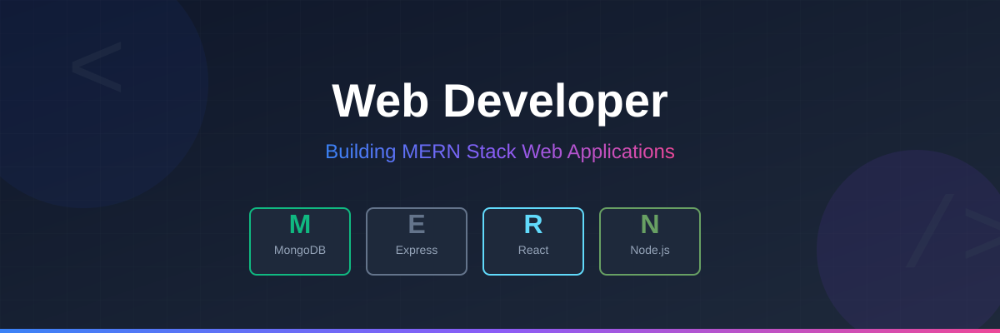

<h1 align="center">Hi 👋, I'm Tafsir Chy</h1>
<h3 align="center">MERN Stack Web Developer</h3>

## 👋 About Me

Hi, I'm a passionate **MERN Stack Web Developer** who loves building modern, scalable, and user-friendly web applications.  
I work with **MongoDB, Express.js, React, Node.js**, and frequently **Tailwind CSS** to create full-stack solutions — from beautiful UIs to well-structured APIs.  

Clean code, performance, responsive design, and turning ideas into real products are what keep me excited every day.  

🚀 **Let's build something awesome together!** 🚀

### 🚀 Current Activities

- 🔭 Currently working on **Web Development projects**
- 🌱 Learning **Next.js** with a focus on **Server-Side Rendering (SSR)**
- 🔍 Improving backend performance using **Node.js & MongoDB**
- 📚 Strengthening my knowledge of **Data Structures & Algorithms** for long-term career growth
- 👯 Open to collaborating on **Web Development & MERN Stack projects**
- 🤔 Seeking opportunities to learn and improve through real-world development
- 💬 Ask me about **Web Development, MERN Stack, or JavaScript**
- 📫 Reach me at: **tafsirchy1000@gmail.com**
- 😄 Pronouns: **He/Him**
- ⚡ Fun fact: I love writing clean and optimized code 💻

## 💻 Tech Stack (MERN Stack Web Developer)

### 🌐 Frontend

### 🧠 Backend

### ⚡ Frameworks & Platforms

### 🎨 Design & Tools

### 🧩 Programming Fundamentals

## 🌐 Socials:
     

# 📊 GitHub Stats:
 
 

## 🏆 GitHub Trophies

### ✍️ Random Dev Quote

### 🔝 Top Contributed Repo

---

<!-- Proudly created with GPRM ( https://gprm.itsvg.in ) -->
